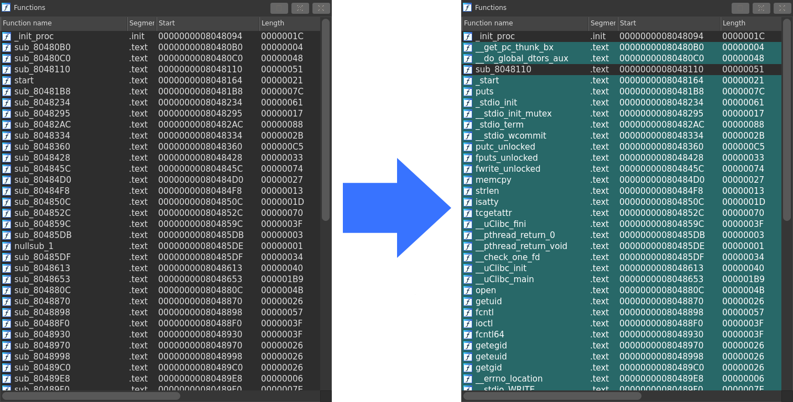

# stelftools: cross-architecture static library detector for IoT malware

## Description

`stelftools` is a signature matching tool for identifying statically-linked library functions for IoT malware. Detecting library functions in IoT malware is essential because most IoT malware is likely to contain a certain amount of code of library functions, which we do not need to read for analysis. `stelftools` reduces the effort of analysts to read such a part of code by correctly identifying and annotating them with their symbol name.
The figure below shows that `stelftools`(IDA plugin mode) recognizes many functions and turns their names, which are started with "sub_", into their symbol name, highlighted by green.

<div align="center">

</div>

`stelftools` comprises a matching tool and a set of YARA signatures supporting the following 17 architectures and over 700 toolchains. We can cover almost all types of toolchains we can see in current IoT malware with these signatures. Specifically, we could identify the all toolchain of 3,991 IoT malware that we had collected using our IoT honeypots. Additionally, we provide a tool for generating a YARA signature from a given toolchain just in the case when malware is built with a toolchain that is not covered by these signatures.

- Supported Architecture
  - ARC
  - ARM / AArch64
  - MIPS / MIPSEL / MIPS64 / MIPS64EL
  - Motorola 68000
  - PowerPC / PowerPC64
  - RISC-V 32 / RISC-V 64
  - SuperH
  - SPARC / SPARC64
  - Intel 80386 / x86_64

Moreover, we developed several heuristics based on our observation of compiler and linker behaviors into `stelftools` to reduce false detection. We then achieved the highest detection accuracy, i.e., 97.18%, compared to publicly available tools for statically-linked library function detection, such as IDA FLIRT [1], BinDiff [2], or rizzo [3].

We can use `stelftools` as a command-line tool or a plugin for a reverse engineering tool of IDA and Ghidra. We believe it would be a best friend for practitioners to keep close with and use in their daily IoT malware analysis.

## Features
`stelftools` is composed of the following three parts: pattern matcher, YARA signatures, and generator.

- Pattern Match (`stelftools.match` + `plugins/ida.py` / `plugins/ghidra.py`)
  - It receives an ELF binary as an input, and then it outputs a list of detected functions' address and name.
  - It has several heuristics to reduce false detection.
    - Exclude detection on the basis of short rules
    - Exclude detection that occurred outside of user-defined areas.
    - Prioritize based on library function dependencies and link order.
  - You can also invoke this script from a reverse engineering tools, such as IDA or Ghidra, as well as using as a command-line tool.

- YARA Signatures (`signatures/<family>/<arch>/`)
  - We generated YARA signatures for 17 architectures and over 700 toolchains in advanced and published them in the `stelftools` repository.
  - We can cover almost all toolchain used in current IoT malware dataset with these signatures.

- Pattern Generation (`stelftools.generate`)
  - It receives a toolchain path as an input, i.e., a path to a directory containing .a and .o files (static library files), and then it outpus YARA rules for detecting the library functions of the static library files.
  - It generates a set of flexible rules supporting relocation, optimization and linker relaxation to achieve a high detection accuracy.


## Comparison with other function identification tools

We have compared `stelftools` with other tools for statically-linked library function detection, IDA FLIRT [1], BinDiff [2], and rizzo [3], using the dataset composed of `150` malware samples.
The below table shows the results of the comparison. As you can see, `stelftools` achieves the highest detection accuracy indicating that it correctly detected 97.18% of the statically-linked functions used in the dataset.

| `stelftools` | IDA FLIRT | BinDiff | rizzo  |
| ------------ | ----------| --------| -------|
| 97.18%       | 91.79%    | 82.82%  | 81.56% |

## Requirement
### python3 package
|  Package    | Version |
|:------------|:--------|
| [arpy](https://pypi.org/project/arpy/)                 | 2.2.0  |
| [yara-x](https://pypi.org/project/yara-x/)             | 1.16.0 |
| [capstone](https://pypi.org/project/capstone/)         | 5.0    |
| [pyelftools](https://pypi.org/project/pyelftools/)     | 0.28   |
| [python-magic](https://pypi.org/project/python-magic/) | 0.4.25 |
| [cxxfilt](https://pypi.org/project/cxxfilt/)           | 0.3.0  |

## Quick start

```bash
# 1. Install dependencies and configure paths.
./tools/setup/init.sh

# 2. Fetch the published signature tree (not committed to the repo).
stelftools fetch

# 3. Identify the toolchain of an ELF and list its library functions.
stelftools identify ./samples/built/main.i586
```

That is enough to get a first verdict. The full CLI reference, plugin
setup steps, legacy-script migration table, and threshold / coverage
flags live in the usage documentation:

- **English** — [docs/usage.md](docs/usage.md)
- **日本語** — [docs/usage.ja.md](docs/usage.ja.md)

For contributors editing the codebase, install the `dev` extra:

```bash
uv pip install -e '.[dev]'
ruff check .
```

## Documentation

- [docs/usage.md](docs/usage.md) / [docs/usage.ja.md](docs/usage.ja.md) — CLI verbs, plugin setup, examples, legacy-script migration table.
- [docs/paper_to_code.md](docs/paper_to_code.md) — map from the two reference papers behind stelftools (Akabane & Okamoto 2020 / 2021) to the modules that implement each concept.
- [docs/ci-bootlin.md](docs/ci-bootlin.md) — CI pipeline that builds and publishes Bootlin-toolchain signatures.

## License
MIT License

## References

stelftools is the reference implementation of two papers by its authors, Akabane & Okamoto:

- "Identification of toolchains used to build IoT malware with statically linked libraries" (2021). https://www.sciencedirect.com/science/article/pii/S1877050921020305 — the multi-architecture method behind the 10 architectures supported today, and the "all library functions identified" gate.
- "Identification of library functions statically linked to Linux malware without symbols" (2020). https://www.sciencedirect.com/science/article/pii/S1877050920319487 — the original Intel 80386 method; source of the libc-region anchors and the 90% default threshold.

Tools compared against in the table above:

- [1] IDA F.L.I.R.T. https://hex-rays.com/products/ida/tech/flirt/
- [2] BinDiff https://www.zynamics.com/bindiff.html
- [3] rizzo https://github.com/tacnetsol/ida
