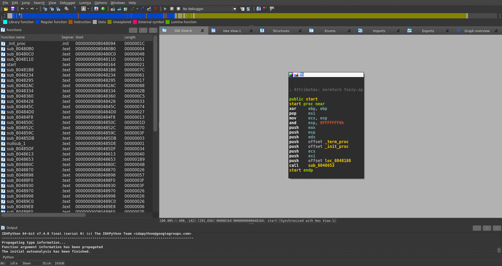
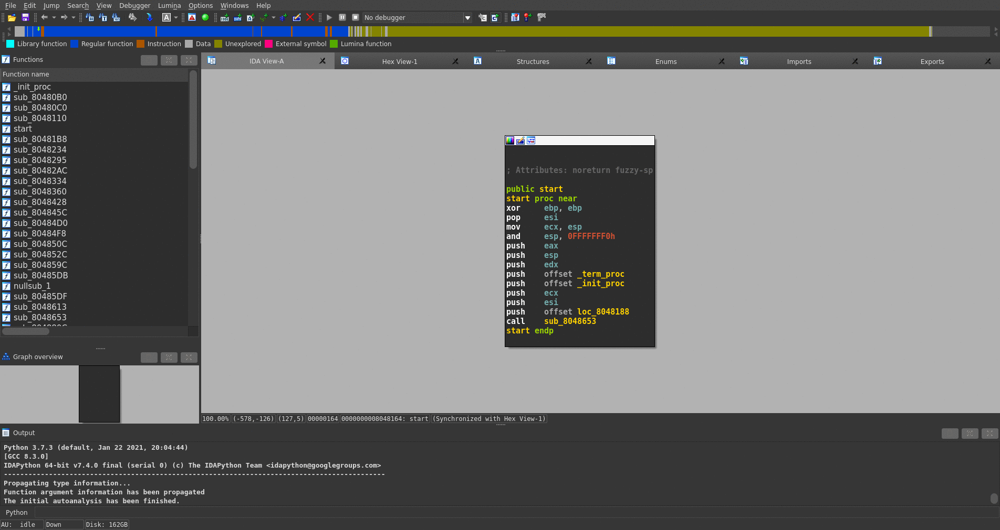
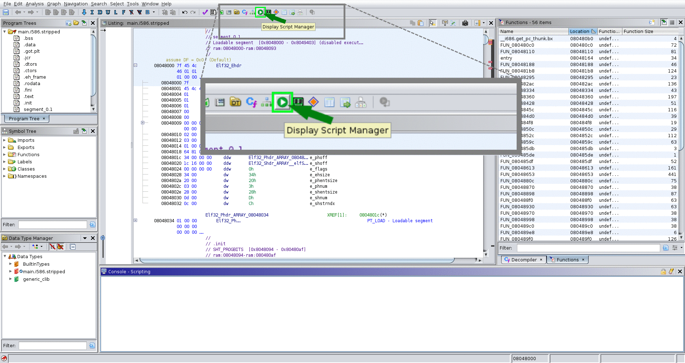

# How to Install
stelftools is usable on the command line or as a plugin for IDA Pro or Ghidra.
### init setup
Install the python3 package used by stelftools and update the paths in scripts.
```bash
./tools/setup/init.sh
```
## IDA Pro plugin setup
Create a symbolic link to stelftools in the IDA plugin directory.
```bash
./tools/setup/ida.sh {path to IDA Pro install directory}
```
## Ghidra plugin setup
Create a symbolic link to stelftools in the ghidra script directory.
```bash
./tools/setup/ghidra.sh {path to ghidra install directory}
```

# How to Use
stelftools can be executed in three ways.

## Command line mode
The single ``stelftools`` entry point dispatches four verbs: ``identify``, ``symbolize``, ``mkrule``, ``fetch``. Run ``stelftools --help`` to list them and ``stelftools <verb> --help`` for the flags of any one.

A *toolchain config JSON* (often shortened to ``cfg`` in flag names) is the file under ``signatures/<family>/<arch>/<name>.json`` that points the matcher at one toolchain's YARA rules, alias list (``.alist``), and dependency list (``.dlist``).

#### Fetch published signatures
The signature tree is not committed; download it from GitHub Release attachments.
```bash
# Everything in the manifest.
stelftools fetch

# Only the arches you care about.
stelftools fetch --family bootlin-stable --arch mips32el,aarch64
```

#### Identify the toolchain of an ELF
```bash
stelftools identify /path/to/target
```
With auto-detection of architecture and libc family, the verb walks every candidate config, ranks them, and prints the coverage-based verdict (``identified`` / ``unidentified``).

- ``--cfg PATH`` — apply a single toolchain config explicitly (skip the auto-pick).
- ``--threshold P`` — coverage threshold for the identified verdict. The default ``0.9`` reports a toolchain as identified when at least 90% of its library functions match. Pass ``--strict`` (or ``--threshold 1.0``) to require a full match.
- ``--coverage-metric {function,bytes}`` — ``function`` (default; identified libc functions divided by libc functions present in the binary) or ``bytes`` (matched libc-region bytes divided by total libc-region bytes; an older byte-level computation kept for backward compatibility).
- ``-o {default,compare,ida,ghidra,count,no}`` — per-function output style.

##### Recommended toolchain order when ``--cfg`` is omitted
IoT malware are concentrated on a small set of toolchains, so ``stelftools identify`` walks the candidate list in that observed order:

- firmware linux 0.9.6 (``fl-0.9.6_{arch}``)
- firmware linux 0.9.7 ~ 0.9.11 (``fl-{version}_{arch}``)
- aboriginal linux 1.0.0 ~ 1.4.5 (``al-{version}_{arch}``)
- bootlin (``bl-stable-{version}_{libc}_{arch}``)
- other

#### Generate YARA signatures from a toolchain
```bash
stelftools mkrule /path/to/toolchain \
    --name {toolchain name} \
    --arch {target architecture} \
    --compiler /path/to/cross-gcc
```
- ``<toolchain-path>`` (positional, optional) — toolchain root containing ``.a`` / ``.o`` archives. When omitted, the path is derived from ``--compiler`` (two directory levels up).
- ``--name`` — signature name (must start with a known family prefix: ``fl-``, ``al-``, ``bl-stable-``, ``br-``, ``ct-ng``, ``ucli-pub-``, ``synopsys_arc_gnu``).
- ``--arch`` — target architecture.
- ``--compiler`` — path to the cross-gcc binary in the toolchain.

#### Symbolize a stripped ELF
```bash
stelftools symbolize /path/to/target --out-elf /path/to/output
```
Runs identify (when ``--cfg`` is omitted) and writes the matched library-function names into a fresh ``.symtab`` on a copy of the ELF. IDA / Ghidra read the appended symtab on import, so functions appear by name with no database mutation.

#### Legacy console scripts
The pre-1.0 hyphen-separated scripts (``stelftools-ident``, ``stelftools-mkrule``, ``stelftools-bruteforce``, ``stelftools-symbolize``, ``stelftools-fetch-signatures``) still work but print a one-line deprecation warning and forward to the new verbs.

## IDA plugin mode
##### Library Function Identification
1. **File** → **Load file** → **Stelftools toolchain config file...**
2. open toolchain config file


##### YARA Rules Generation
1. **File** → **Produce file** → **Stelftools toolchain config file...**
2. input toolchain name
3. choose toolchain compiler path
4. input toolchain architecture



## Ghidra plugin mode
##### Library Function Identification
0. **Script Manager** → Scripts/stelftools/python/**ghidra_stelftools.py** → select **func_ident**
1. select toolchain json file (toolchain_name.json)


##### YARA Rules Generation
0. **Script Manager** → Scripts/stelftools/python/**ghidra_stelftools.py** → select **make_rules**
1. type toolchain name
2. select toolchain directory
3. select a compiler for the toolchain (additional option)
4. type architecture


The papers behind stelftools and a map from their sections to the code are listed in the [project README](../README.md#references) and [docs/paper_to_code.md](paper_to_code.md).
